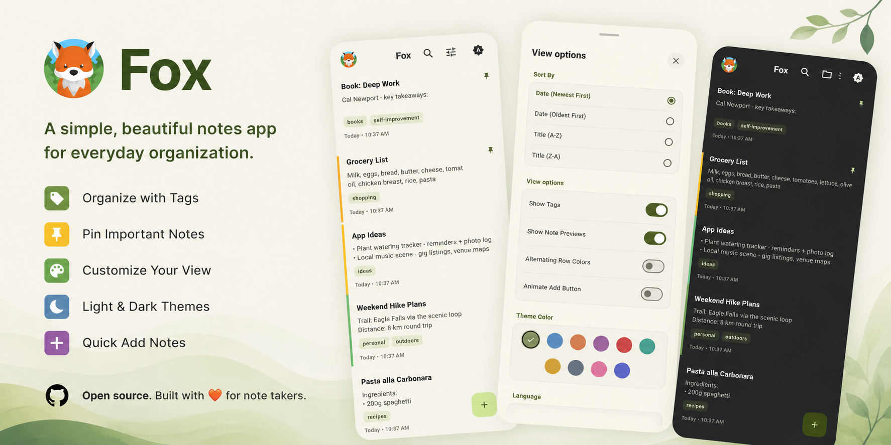

<picture>
  <source media="(prefers-color-scheme: dark)" srcset="assets/images/github/banner.png">
  
</picture>

<p align="center">
  <a href="LICENSE"></a>
  
  
</p>

<p align="center">
  <a href="https://play.google.com/store/apps/details?id=com.teamsuperpanda.fox"></a>
  <a href="https://apps.apple.com/app/fox-list/id1625597940"></a>
</p>

Fox is a notes app that stays out of your way. Rich text, dark mode, offline-first. No account, no subscription, no cloud dependency.

Built by [Team Super Panda](https://www.teamsuperpanda.com).

---

## What it does

Fox is what happens when you strip a notes app down to what actually matters: writing, organising, and finding things fast.

- **Rich text**: bold, italic, bullet lists, ordered lists, note colours. No markdown syntax to remember.
- **Pin, tag, search**: find any note in seconds, even with hundreds of them.
- **Dark mode**: light and dark themes that actually look good.
- **Offline-first**: it's a local app that happens to have an editor. Your notes live on your device, always available, no signal required.
- **No accounts**: download it and start typing. There is no signup screen.

---

## Tech

Fox is a Flutter app with a deliberately simple stack:

| Layer | Choice |
|---|---|
| UI | Flutter with Provider |
| Storage | Hive (local, no server) |
| Editor | Flutter Quill |
| Fonts | Inter (bundled, no network calls) |

No backend. No sync. No app data leaves your device. (Optional anonymous analytics, disabled by default.)

---

## Run it

```bash
git clone https://github.com/teamsuperpanda/fox.git
cd fox
flutter pub get
flutter run
```

### Tests

```bash
flutter test --coverage
```

---

## License

The code is [PolyForm Noncommercial 1.0.0](LICENSE). Free for personal use, not for resale.  
Assets are copyright 2026 Team Super Panda (see [ASSETS-LICENSE.md](ASSETS-LICENSE.md)).
